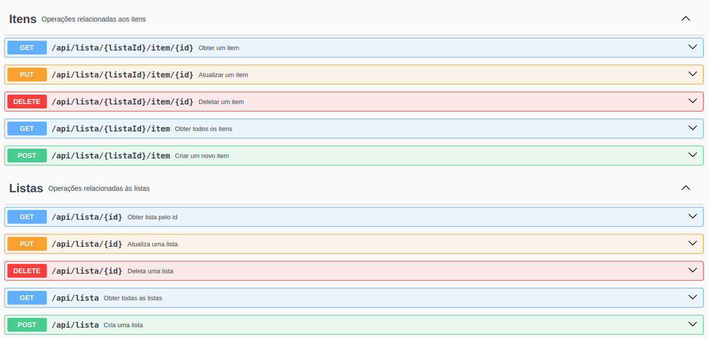

# Task Manager API

Bem-vindo ao TaskManager API! Este é um serviço de gerenciamento de tarefas que permite criar, atualizar, listar e excluir tarefas.

Este projeto é uma aplicação Java desenvolvida seguindo os princípios da `Clean Architecture`. A Clean Architecture visa criar sistemas que são independentes de frameworks, facilmente testáveis, e com uma separação clara entre regras de negócio e detalhes de implementação.

[//]: # (![Clean Archtecture]&#40;assets/clean-architecture.jpg&#41;)
<div align="center">
    
</div>

### Introdução
A TaskManager API permite a você gerenciar suas tarefas de maneira eficiente e organizada. Com ela, você pode adicionar novas tarefas, visualizar todas as tarefas, atualizar tarefas existentes e removê-las quando necessário.

## Requisitos

- Java 21 JDK
- Spring Boot 3.3.2
- Gradle
- JPA
- MySQL
- Swagger

## Instalação

### Clonando o Repositório

```sh
git clone https://github.com/alexandreluchetti/taskManager.git
cd taskManager
```

### Compilando o Projeto

1. Compile o projeto e empacote o JAR:
```sh
./gradlew build
```

## Uso

### Executando a Aplicação

Depois de compilar o projeto, você pode executar o JAR gerado com o seguinte comando:

```sh
./gradlew bootRun
```

### Operações disponíveis
```text
GET - /api/lista/{listaID}/item/{id}: Obter um item de acordo com o listaId e itemId do item informado.

GET - /api/lista/{listaID}/item: Obter todos os itens de acordo com o listaId informado.

POST - /api/lista/{listaID}/item: Cria um item para a lista com o listaId informado.

PUT - /api/lista/{listaID}/item/{id}: Atualiza um item de acordo com o listaId, itemId e ItemDto informados.

DELETE - /api/lista/{listaId/item: Deleta um item de acordo com o listaId e itemId informados.

GET - /api/lista/{listaID}: Obter uma lista de acorco com o id informado.

GET - /api/lista: Obter todas as listas.

POST - /api/lista: Cria uma lista de acordo com o ListaDto informado.

PUT - /api/lista/{listaId}: Atualiza uma lista de acordo com o listaId e ListaSemItensDto informados. Obs.: Para alterar os itens de uma lista, utiliza a operacao PUT - /api/lista/{listaId}/item/{id}.

DELETE - /api/lista/{listaId}: Deleta uma lista de acordo com o listaID informado.
```
#### - ItemDto:
```json
{
  "titulo": "string",
  "estado": true,
  "prioridade": true
}
```

#### - ListaSemItensDto
```json
{
  "nome": "string"
}
```

#### - ListaDto
```json
{
  "nome": "string",
  "itemDtos": [
    {
      "titulo": "string",
      "estado": true,
      "prioridade": true
    }
  ]
}
```

<div align="center">
    
</div>

## Contribuição

1. Faça um fork do projeto
2. Crie uma branch para sua feature: `git checkout -b minha-feature`
3. Commit suas mudanças: `git commit -am 'Adiciona minha feature'`
4. Faça push para a branch: `git push origin minha-feature`
5. Envie um Pull Request

## Licença

Este projeto está licenciado sob a Licença MIT - veja o arquivo [LICENSE](LICENSE) para mais detalhes.